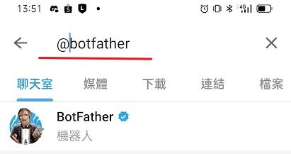
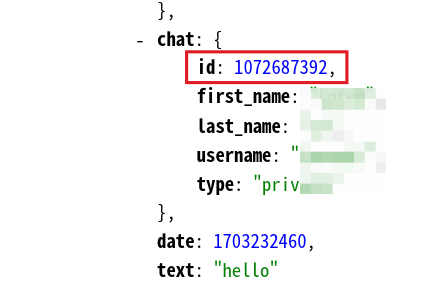
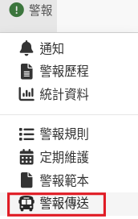
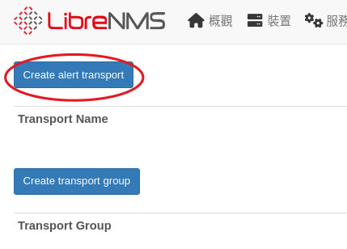

# 警報

裝置離線或是溫度過高， LibrenNMS 可以發出警報提醒，除了顯示警報在 LireNms 界面外，還可以使用多種通知方式 ex: mail、sms、telegram 通知網管，以下將介紹使用 telergam 或 mail 來傳送警報訊息，要主動傳送警報，有三個部份需要設定:

1. **傳送器**： 設定 librenms 要怎麼傳送訊息（以下示範使用 telegram）
2. **警報規則**： 什麼事件（條件）會觸發警報
3. **警報範本**： 發生事件時要傳送的內容

## Telegram 傳送器

### 1. telegram 安裝及中文化
可先參考以下網頁，安裝 telegram [telegram 安裝及中文化](https://www.pkstep.com/archives/13832)

### 2. 申請 telegram bot

在 telergram 搜尋 @botfather 這個帳號，然後點入跟這個機器人聊天


在聊天室打上依序打上以下的內容，就可以取得機器人的 token，請記住這個資訊


接著在瀏覽器打上，將<你的token>替換成前面取到的 token

[https://api.telegram.org/bot<你的token>/getUpdates](https://api.telegram.org/bot<你的token>/getUpdates)

我們需要的就是回傳資料裡面的聊天室id(chat id)



### 3. 建立 librenms 警報傳送器
1. 

2. 

3. 傳送器類型選擇：telegram。 填入前面取得的 chat id 跟 token，格式可以選擇 HTML 也可以順便設定為預設的傳送器


#### 測試傳送器是否正常

建立傳送器後，在該列的右方，有一個按鈕可以先讓我們先測試是否可以正常發送訊息，可以先確認正常後，再做接下來的「警報規則」及「範本」
![[1750664656676.png]]

## Mail 傳送器（使用 postfix）

使用 linux 系統本身的 smtp 來寄信最簡單，只需要在 ubuntu 安裝 postfix　套件
```Shell
sudo apt install postfix
```

在 Librenms 的【全域設定/警報/電子郵件設定】，將發送郵件的方式設定為 mail 或是 sendmail 都可以
![[1750652432508.png]]

接著建立 mail 傳送器即可

![[1750653724238.png]]

## Mail 傳送器（使用 Gmail 應用程式密碼）

1. 首先到 gmail 的帳戶設定頁面，必須要先開啟「　==兩步驟驗證==  (Two-factor authentication (2FA))」才會有 ==「應用程式密碼」== 的功能
2. 在 Gmail 的帳戶設定，使用搜尋「應用程式密碼」（網頁似乎已經找不到此功能的連結，所以要直接用搜尋才能找到）

3. 新增一個應用程式，取名為 Librenms ，Google 就會產生一個應用程式密碼，這個密碼只會顯示一次，所以要自己保存起來。

3.　中間顯示的密碼，總共連續16個字元，如果使用複製功能，記得要把中間的空白都刪除，才是正確的密碼

![[1750664024971.png]]
這個密碼就是用來給一般應用程式登入你的 mail 寄信用，避免某些系統直接知道你的 gmail 密碼。

4.　在 Librenms 的【全域設定/警報/電子郵件設定】，將發送郵件的方式設定為　SMTP，然後依下列方式設定， mail 請改成自己的 mail

![[1750664418474.png]]