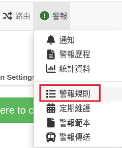
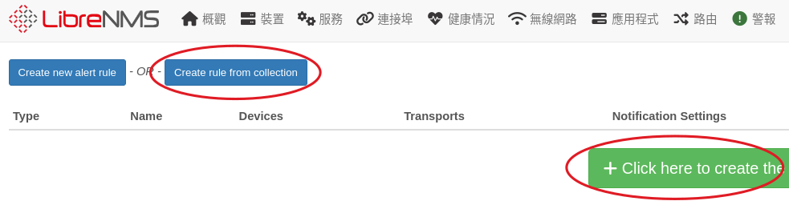
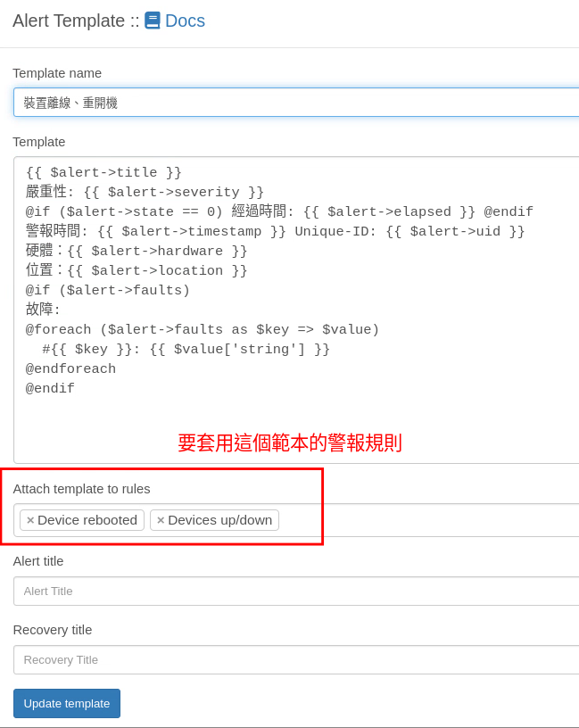

# 警報規則 & 警報範本


有了傳送器，接下來要建立什麼時候要傳送警報
## 1. 建立警報規則
1. 執行主選單【選單/警報規則】


2. 中間有個按鈕，點下去就會建立很多預設的規則，有興趣可以直接建立，然後觀看學習。 Librenms 也收集很多規則可以套用，所以手動建立規則也很方便


3. 以下使用 Create rule from collection 手動建立，按下 Create rule from collection 按鈕，裡面有收集很多規則，我們選擇 Devices up/down ，當裝置離線時，就會產生警報

設定警報條件


## 2. 警報範本
有傳送器，有規則，最後還要有警報範本（要傳送的警報內容），這三項缺一不可。
官方說明有提供範本內容，依據不同規則，我們需要知道的資訊不一樣，所以才需要不同範本。例如裝置斷線我們只需要知道是哪台主機跟位置，硬碟容量使用過高，我們會想要知道硬碟空間使用多少、剩餘多少...等。
也可以所有規則都套用一個警報範本，只是這樣警報的內容可就會太複雜或是缺少需要的資訊。

[官方文件：Templates](https://docs.librenms.org/Alerting/Templates/)

底下是一個純文字的警報範本
```
{{ $alert->title }}
嚴重性: {{ $alert->severity }}
@if ($alert->state == 0) 經過時間: {{ $alert->elapsed }} @endif
警報時間: {{ $alert->timestamp }} Unique-ID: {{ $alert->uid }} 
硬體：{{ $alert->hardware }}
位置：{{ $alert->location }}
@if ($alert->faults)
故障:
@foreach ($alert->faults as $key => $value)
  #{{ $key }}: {{ $value['string'] }}
@endforeach
@endif
```



接著就等待警報發生吧! >< (聽起來怎麼怪怪的！！)
